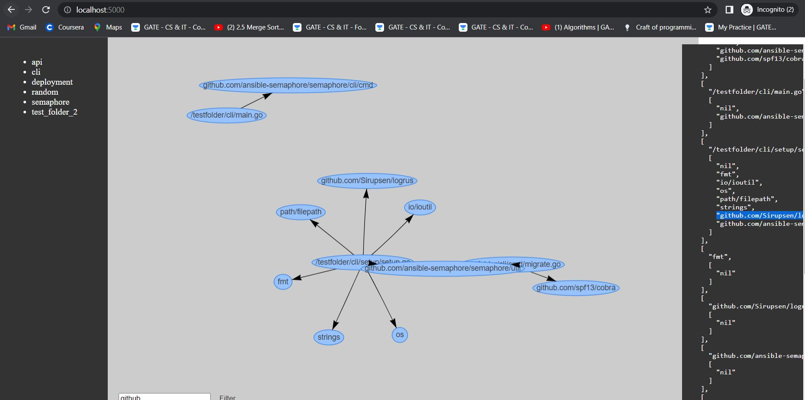
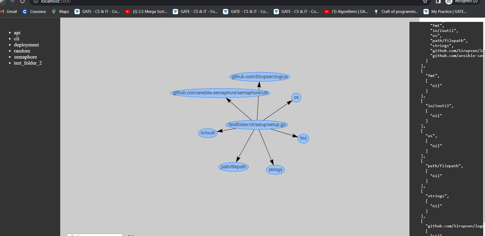

# DependencyVisualiser: This is still WIP
## Description
Dependncy Visualiser is meant for visualising dependencies of golang based projects and perform analysis on them.
The visualiser captures modules in a repo and their dependencies as an adjacency list.
Essentially the module becomes the source vertex and each dependency becomes the destination vertex to which the module points to.
Thus we form a directed graph. By nature if your project is compiling the graph is also acyclic, since golang compiler breaks on having [cyclical dependencies](https://www.positioniseverything.net/import-cycle-not-allowed/#:~:text=Golang%20does%20not%20allow%20cyclic,if%20your%20packages%20are%20interdependent.), thus for a successflly compiled project we form a *DAG*.

## Why is a graph helpful?
Once we get the dependency graph we can use it to perform analysis leveraging various graph algorithms.
Few of the analysis currently performed by dependency visualiser include:
1. Just by  default, rendering a graph tells us how the components are connected.
2. On clicking a particular vertex, we traverse the graph with that vertex as source and thus get the dependency graph of the said vertex.
3. We can filter the graph to only show modules that point to a dependency with specific keywords, this can be useful in filtering only
the dependencies which are grouped together by a common prefix.
Currently adding more features is in progress.
### More features planned to be added: 
1. *perform topological sorting on the graph* topological sorting can be done on dircted acyclic graphs to get an order in which verticies can be traversed such that when a particular vertex is visited, all vertices that can point to the said vertex have already been visited.
2. *Get a minimum cut of the graph* this gives the minimum set of vertices required to break the graph into two disjoint sets, this can be used to find out critical dependencies which become the choke points of the repository as well.

## 
This application leverages network module provided by [vis.js](https://visjs.org/) to render a graph.
The dependencies of a module, can be found using [AST](https://pkg.go.dev/go/ast) package provided by go.
Recursively walk a directory we can form an adjacency list with each module as the source and dependencies as destination.

## Usage
### Pre-requisites
Requires docker to be installed on your machine.

### build docker image
From the root of the repo run `docker build -t <my_image_name> -f Docker/dockerfile .`, replacing <my_image_name> with your preffered image name.

## Run docker image in the container
First identify the module you want to analyse(should usually have 1 or more golang projects), then mount it as a volume, expose the port 5000 on container to a free port of your choice on your local machine, provide the image id.
### Get the image id
`docker image ls`
### Run the docker image
`docker run -t -d -v <folder to analyse>:/testfolder/ -p<yourport>:5000 --name=volume_analyser <image name>`
Example:
`docker run -t -d -v C:\Users\gupta\OneDrive\Documents\test:/testfolder/ -p--name=volume_analyser 9cd05bb0862c`
### Interacting with application
Once above steps are done, application can be interacted with on `localhost:<port-exposed>`

## Sample Visualisation Images:

### graph of a particular repo

### dfs a particular module from the above graph

